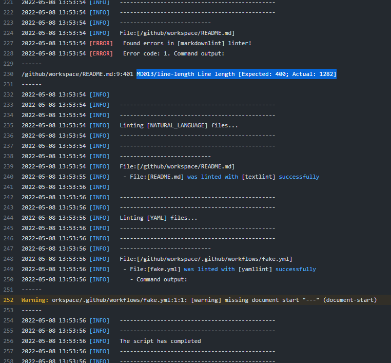
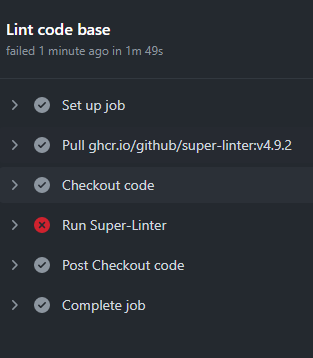

# MyGitHubActionsPythonLint

My GitHub Actions Python Lint app

## Customize linter

To run with your own configuration for a linter, copy the relevant TEMPLATE configuration file for the linter you are using from this repository into the .github/linters/ folder in your own repository, and then edit it to modify, disable - or even add - rules and configuration to suit how you want your code checked.

i.e.

~/.github/linters/.markdown-lint.yml

```yaml
MD013:
  line_length: 2000 # Line length 80 is far to short
```

## Screenshot






## Troubleshooting

```bash
Run github/super-linter@v3
/usr/bin/docker run --name ghcriogithubsuperlinterv3171_276c5c --label 08450d --workdir /github/workspace --rm -e DEFAULT_BRANCH -e GITHUB_TOKEN -e HOME -e GITHUB_JOB -e GITHUB_REF -e GITHUB_SHA -e GITHUB_REPOSITORY -e GITHUB_REPOSITORY_OWNER -e GITHUB_RUN_ID -e GITHUB_RUN_NUMBER -e GITHUB_RETENTION_DAYS -e GITHUB_RUN_ATTEMPT -e GITHUB_ACTOR -e GITHUB_WORKFLOW -e GITHUB_HEAD_REF -e GITHUB_BASE_REF -e GITHUB_EVENT_NAME -e GITHUB_SERVER_URL -e GITHUB_API_URL -e GITHUB_GRAPHQL_URL -e GITHUB_REF_NAME -e GITHUB_REF_PROTECTED -e GITHUB_REF_TYPE -e GITHUB_WORKSPACE -e GITHUB_ACTION -e GITHUB_EVENT_PATH -e GITHUB_ACTION_REPOSITORY -e GITHUB_ACTION_REF -e GITHUB_PATH -e GITHUB_ENV -e GITHUB_STEP_SUMMARY -e RUNNER_OS -e RUNNER_ARCH -e RUNNER_NAME -e RUNNER_TOOL_CACHE -e RUNNER_TEMP -e RUNNER_WORKSPACE -e ACTIONS_RUNTIME_URL -e ACTIONS_RUNTIME_TOKEN -e ACTIONS_CACHE_URL -e GITHUB_ACTIONS=true -e CI=true -v "/var/run/docker.sock":"/var/run/docker.sock" -v "/home/runner/work/_temp/_github_home":"/github/home" -v "/home/runner/work/_temp/_github_workflow":"/github/workflow" -v "/home/runner/work/_temp/_runner_file_commands":"/github/file_commands" -v "/home/runner/work/MyGitHubActionsPythonLint/MyGitHubActionsPythonLint":"/github/workspace" ghcr.io/github/super-linter:v3.17.1
/action/lib/linter.sh: line 57: /action/lib/functions/tapLibrary.sh: No such file or directory
--------------------------------------------------------------------------------

                              /@@#///////@@/(@//@%/(@.@(       @@
                          @@//////////////////////////////#*  @@@
                        @////@//(///////////@@@@@///@//@/@**//@@(
                      @///////@///////////////@@@@    (           @,
                     @/(&/@////////////////////                     @
                    @////////////////////////@@                      @
                  @%////////(//////////%/////&@            @@       *,@           ______________
             @@@@@/@/#/////(&//////////////////                       .@         /              \
        *@@@@@.    .%///(//@//////////////////&.   .@@,                 @%      / Don't mind me  \
      @@%           .&@&&/@.@//&/////(//////////    @@@@@@@@@         .. &@    / I'm just looking \
    @@%               @@@@@   @&/////////////////#   @/       V  @@/ ,@@@ @   <  for some trash... |
@@@%                   @@@@        .%@@@@//////#@ @   @@         @     .,.     \__________________/
                                          @@@/@(  (@@@@% @/\      %
                                           @@@@(    .     .@@/\   #
                                             @                  %@%

--------------------------------------------------------------------------------
2022-05-08 13:41:51 [INFO]   ---------------------------------------------
2022-05-08 13:41:51 [INFO]   --- GitHub Actions Multi Language Linter ----
2022-05-08 13:41:51 [INFO]    - Image Creation Date:[]
2022-05-08 13:41:51 [INFO]    - Image Revision:[]
2022-05-08 13:41:52 [INFO]    - Image Version:[]
2022-05-08 13:41:52 [INFO]   ---------------------------------------------
2022-05-08 13:41:52 [INFO]   ---------------------------------------------
2022-05-08 13:41:52 [INFO]   The Super-Linter source code can be found at:
2022-05-08 13:41:52 [INFO]    - https://github.com/github/super-linter
2022-05-08 13:41:52 [INFO]   ---------------------------------------------
2022-05-08 13:41:52 [FATAL]   Failed to view version file:[/action/lib/functions/linterVersions.txt]
```

```bash
This workflow has no runs yet.
```
